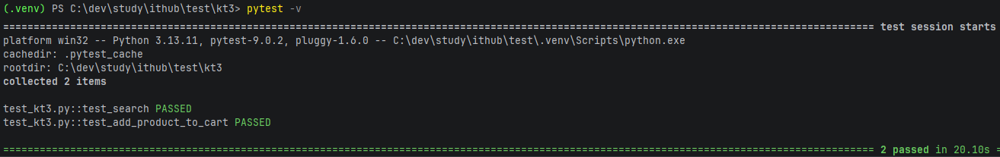

# Тестирование функционала веб-приложения с применением Page Object.
КТ № 3. Паттерн PageObject

## Выбранное приложение
**https://4lapy.ru/** — крупный интернет-магазин для животных. Сайт доступен, имеет поиск, каталог, корзину и оформление заказа.

## Тестируемые сценарии
- Проверка поиска товаров (`test_search`)
- Проверка добавления товара в корзину (`test_add_product_to_cart`)

## Среда и запуск
```bash
pip install -r requirements.txt
```

```bash
pytest kt2/test_kt2.py -v
```

---

# Анализ результатов и отчет



Тестирование показало, что основные пользовательские сценарии работают корректно:

1. **Поиск товаров** — тест успешно нашел товар по запросу "корм", что подтверждает корректную работу поиска на сайте.
2. **Добавление в корзину** — тест добавил выбранный товар в корзину и проверил его наличие, что подтверждает правильное взаимодействие интерфейса корзины с товарами.

На основе результатов можно сделать вывод, что базовая функциональность сайта стабильна.
